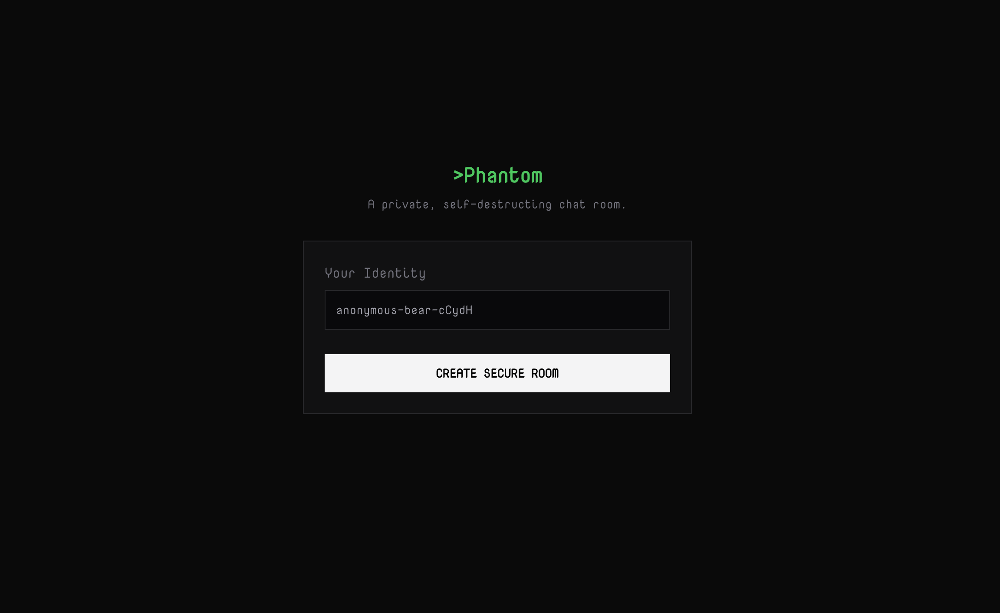

<div align="center">
  <br>
    
  </br>

  <h1 align="center">Phantom</h1>

  <div>
    
    
    
    
  </div>

</div>

## 📋 <a name="table">Table of Contents</a>

1. 🤖 [Introduction](#introduction)
2. ⚙️ [Tech Stack](#tech-stack)
3. 🔋 [Features](#features)
4. 🤸 [Quick Start](#quick-start)

## <a name="introduction">🤖 Introduction</a>

`Phantom` is a *privacy-first*, *self-destructing* chat application designed for secure, trace-free communication. In a world of permanent digital footprints, Phantom ensures your conversations vanish completely once the room expires—no logs, no history, no trace.

Built for speed and reliability, the application features a responsive `Next.js` and `Tailwind CSS` frontend backed by a high-performance `Elysia.js` server. We utilize `Redis` to manage the ephemeral lifecycle of data (TTL), ensuring zero-persistence storage, while `Zod` guarantees strict type safety across the full stack.

## <a name="tech-stack">⚙️ Tech Stack</a>

- Next.js
- TailwindCSS
- Elysia.js
- Redis
- Node.js
- Zod
## <a name="features">🔋 Features</a>

👉 **Zero-Knowledge Persistence**: No database history; messages exist only in volatile memory.

👉 **Time-to-Live (TTL) Rooms**: Automatic destruction of chat rooms after a set duration.

👉 **End-to-End Type Safety**: Powered by TypeScript and Zod schema validation.

👉 **Blazing Fast Performance**: Utilizing the speed of Bun and Elysia.js.

## <a name="quick-start">🤸 Quick Start</a>

Follow these steps to set up the project locally on your machine.

**Prerequisites**

Make sure you have the following installed on your machine:

- [Git](https://git-scm.com/)
- [Node.js](https://nodejs.org/en)
- [npm](https://www.npmjs.com/) (Node Package Manager)

**Cloning the Repository**

```bash
git clone https://github.com/itzzSVR-tech/Phantom.git
cd Phantom
```

**Installation**

Install the project dependencies using npm in both the client and server folders:

```bash
npm install
```

**Set Up Environment Variables**

Create a new file named `.env` in the server folder of your project and add the following content:

```env
UPSTASH_REDIS_REST_URL=<your upstash url>
UPSTASH_REDIS_REST_TOKEN=<your upstash token>
```

Replace the placeholder values with your actual credentials.

**Running the Project**

```bash
npm run dev
```

Open `http://localhost:3000` in your browser to view the project.
